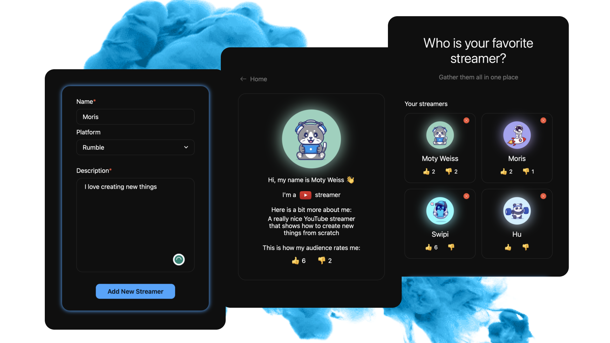
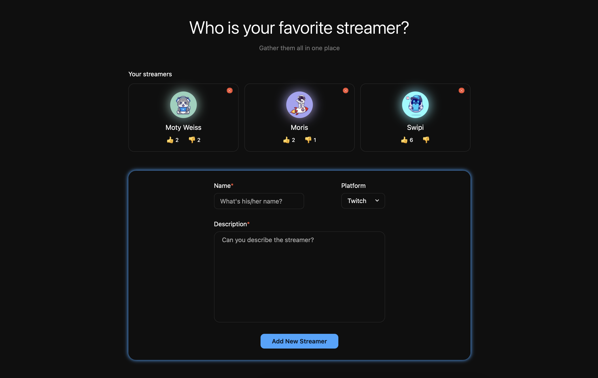
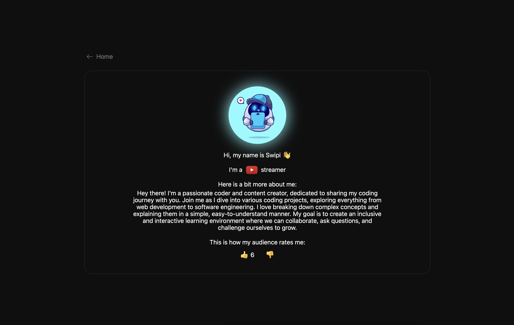
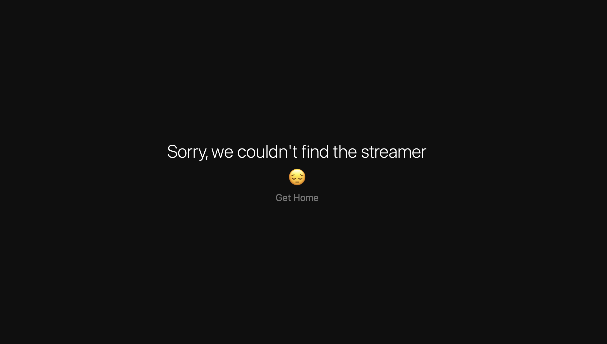

<h1 align='center'>Streamers</h1>



<p align='center'>Streamers was made as an assignment from <a href="https://daredrop.com">Dare Drop</a></p>

<h2>Built with</h2>

<h3>Front-End</h3>

- React
- TypeScript
- Styled-Components

<h3>Back-End</h3>

- Node.js
- Express
- PostgreSQL

</br>

<h2>Screenshots</h2>






</br>

<h2>API endpoints</h2>

- **GET** ```/streamers``` - Returns a list of all streamers in the database.
- **GET** ```/streamers/:id``` - Retrieves a specific streamer based on the provided id parameter.
- **POST** ```/streamers``` - Creates a new streamer with the provided data in the request body.
- **PUT** ```/streamers/:id/vote``` - Updates the information of a specific streamer identified by the provided id parameter.
- **DELETE** ```/streamers/:id``` - Deletes a streamer based on the provided id parameter.

</br>

<h2>Request/Response Examples</h2>

Here are some examples of request and response payloads for the endpoints:

1. **GET** ```/streamers```

- Request: nothing to provide

- Response:
```json
[
  {
    "streamer_id": "cd196746-4bec-4199-8198-881eabe61233",
    "name": "Moris",
    "platform": "Kick",
    "description": "Love creating something new",
    "picture_index": 1,
    "upvotes": 6,
    "downvotes": 0,
  }
  {
    "streamer_id": "9be37f97-a557-4dc4-b272-5d87db26023c",
    "name": "Moty Weiss",
    "platform": "Twitch",
    "description": "A really nice YouTube streamer that shows how to create new things from scratch",
    "picture_index": 3,
    "upvotes": 10,
    "downvotes": 3,
  }
]
```

2. **POST** ```/streamers```

- Request:

```json
{
  "name": "Alex",
  "description": "Teaching others how to grow faster",
  "platform": "YouTube",
  "picture_index": 5,
  "upvotes": 0,
  "downvotes": 0
}
```

- Response:
```json
[{
  "streamer_id": "fa9e6e6f-9ea2-4d59-8abc-3f72212da3aa",
  "name": "Alex",
  "description": "Teaching others how to grow faster",
  "platform": "YouTube",
  "picture_index": 5,
  "upvotes": 0,
  "downvotes": 0,
  "created_at": "2023-07-01T04:01:53.625Z"
}]
```

3. **PUT** ```/streamers/:id/vote```

- Request:

```json
{
  "voteType": "upvotes",
  "voteValue": 4
}
```

- Response:
```json
[{
  "streamer_id": "fa9e6e6f-9ea2-4d59-8abc-3f72212da3aa",
  "upvotes": 4,
}]
```

</br>

<h2>Development</h2>

Here are the steps to run the project locally.

1. Clone the repository.

```sh
HTTPS - $ git clone https://github.com/alex-dishen/streamers.git
or
SSH - $ git clone git@github.com:alex-dishen/streamers.git
```

2. Move to the cloned directory.

```sh
$ cd streamers
```

3. Install the dependencies.

You can use ```npm``` instead of ```yarn```

```sh
$ yarn client:i
$ yarn server:i
```

4. Start PostgreSQL server

5. Navigate to ```server/src/db``` and open ```db.sql``` file to see the database and table that has to be created.

6. In the ```server/src/db``` directory open ```index.ts``` file and update the connection data

6. Start Node.js server. Navigate to the top ```streamers```  directory and run ```$ yarn server```

7. Start Vite server ```$ yarn client```