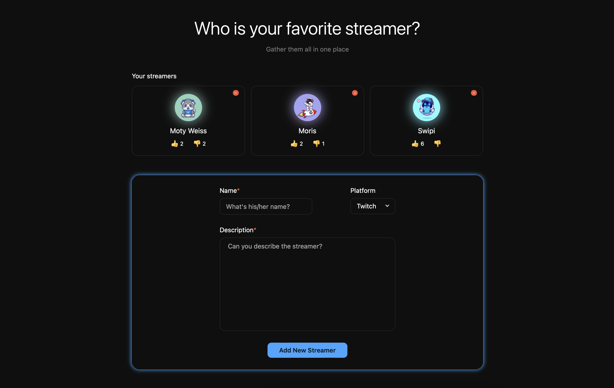
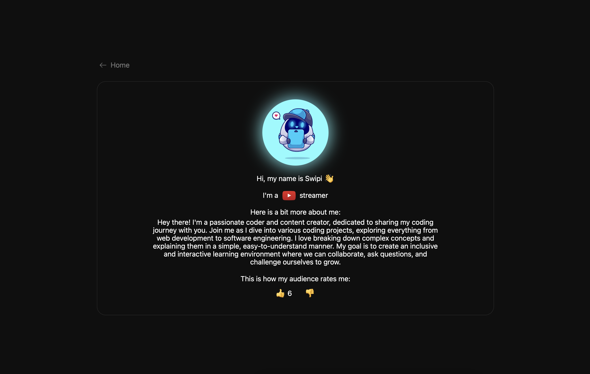

<h1 align='center'>Streamers</h1>

## Built with

- React
- TypeScript
- Styled-Components
- Node.js
- Express
- PostgreSQL

## Screenshots




## APi endpoints

- **GET** ```/streamers``` - Returns a list of all streamers in the database.
- **GET** ```/streamers/:id``` - Retrieves a specific streamer based on the provided id parameter.
- **POST** ```/streamers``` - Creates a new streamer with the provided data in the request body.
- **PUT** ```/streamers/:id/vote``` - Updates the information of a specific streamer identified by the provided id parameter.
- **DELETE** ```/streamers/:id``` - Deletes a streamer based on the provided id parameter.

## Request/Response Examples

Here are some examples of request and response payloads for the endpoints:

1. **GET** ```/streamers```

- Response:
```json
[
    {
        "streamer_id": "cd196746-4bec-4199-8198-881eabe61233",
        "name": "Moris",
        "platform": "Kick",
        "description": "Love creating something new",
        "picture_index": 1,
        "upvotes": 6,
        "downvotes": 0,
    }
    {
        "streamer_id": "9be37f97-a557-4dc4-b272-5d87db26023c",
        "name": "Moty Weiss",
        "platform": "Twitch",
        "description": "A really nice YouTube streamer that shows how to create new things from scratch",
        "picture_index": 3,
        "upvotes": 10,
        "downvotes": 3,
    }
  ]
```

2. **POST** ```/streamers```

- Request:
```json
{
    "name": "Alex",
    "description": "Teaching others how to grow faster",
    "platform": "YouTube",
    "picture_index": 5,
    "upvotes": 0,
    "downvotes": 0
}
```

## Development

Here are the steps to run the project locally.

1. Clone the repository.

```sh
HTTPS - $ git clone https://github.com/alex-dishen/streamers.git
or
SSH - $ git clone git@github.com:alex-dishen/streamers.git
```

2. Move to the cloned directory.

```sh
$ cd streamers
```

3. Install the dependencies.

You can use ```npm``` instead of ```yarn```

```sh
$ cd client
$ yarn
$ cd ../server
$ yarn
$ cd ..
```

4. Start PostgreSQL server

5. Navigate to ```server/db``` and open file ```db.sql``` to see the database and table that has to be created. The execute those commands to create the database and table.

6. Start Node.js server. You are currently in a ```streamers``` directory so run ```yarn server```

7. Start Vite server ```yarn client```